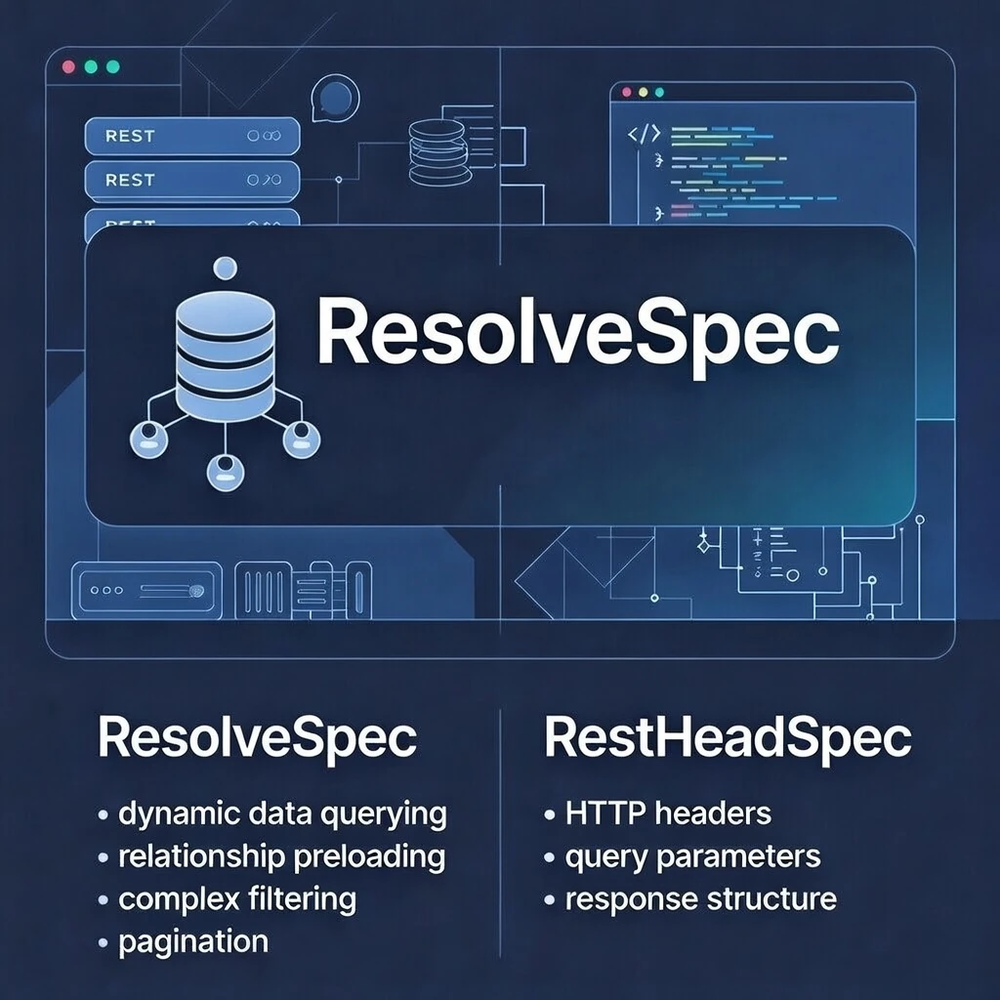

# 📜 ResolveSpec 📜


ResolveSpec is a flexible and powerful REST API specification and implementation that provides GraphQL-like capabilities while maintaining REST simplicity. It offers **two complementary approaches**:

1. **ResolveSpec** - Body-based API with JSON request options
2. **RestHeadSpec** - Header-based API where query options are passed via HTTP headers
3. **FuncSpec** - Header-based API to map and call API's to sql functions.

Both share the same core architecture and provide dynamic data querying, relationship preloading, and complex filtering.

Documentation Generated by LLMs



## Table of Contents

* [Features](#features)
* [Installation](#installation)
* [Quick Start](#quick-start)
  * [ResolveSpec (Body-Based API)](#resolvespec-body-based-api)
  * [RestHeadSpec (Header-Based API)](#restheadspec-header-based-api)
  * [Existing Code (Backward Compatible)](#option-1-existing-code-backward-compatible)
  * [New Database-Agnostic API](#option-2-new-database-agnostic-api)
  * [Router Integration](#router-integration)
* [Migration from v1.x](#migration-from-v1x)
* [Architecture](#architecture)
* [API Structure](#api-structure)
* [RestHeadSpec: Header-Based API](#restheadspec-header-based-api-1)
  * [Lifecycle Hooks](#lifecycle-hooks)
  * [Cursor Pagination](#cursor-pagination)
  * [Response Formats](#response-formats)
  * [Single Record as Object](#single-record-as-object-default-behavior)
* [Example Usage](#example-usage)
  * [Recursive CRUD Operations](#recursive-crud-operations-)
* [Testing](#testing)
* [What's New](#whats-new)

## Features

### Core Features

* **Dynamic Data Querying**: Select specific columns and relationships to return
* **Relationship Preloading**: Load related entities with custom column selection and filters
* **Complex Filtering**: Apply multiple filters with various operators
* **Sorting**: Multi-column sort support
* **Pagination**: Built-in limit/offset and cursor-based pagination
* **Computed Columns**: Define virtual columns for complex calculations
* **Custom Operators**: Add custom SQL conditions when needed
* **🆕 Recursive CRUD Handler**: Automatically handle nested object graphs with foreign key resolution and per-record operation control via `_request` field

### Architecture (v2.0+)

* **🆕 Database Agnostic**: Works with GORM, Bun, or any database layer through adapters
* **🆕 Router Flexible**: Integrates with Gorilla Mux, Gin, Echo, or custom routers
* **🆕 Backward Compatible**: Existing code works without changes
* **🆕 Better Testing**: Mockable interfaces for easy unit testing

### RestHeadSpec (v2.1+)

* **🆕 Header-Based API**: All query options passed via HTTP headers instead of request body
* **🆕 Lifecycle Hooks**: Before/after hooks for create, read, update, and delete operations
* **🆕 Cursor Pagination**: Efficient cursor-based pagination with complex sort support
* **🆕 Multiple Response Formats**: Simple, detailed, and Syncfusion-compatible formats
* **🆕 Single Record as Object**: Automatically normalize single-element arrays to objects (enabled by default)
* **🆕 Advanced Filtering**: Field filters, search operators, AND/OR logic, and custom SQL
* **🆕 Base64 Encoding**: Support for base64-encoded header values

### Routing & CORS (v3.0+)

* **🆕 Explicit Route Registration**: Routes created per registered model instead of dynamic lookups
* **🆕 OPTIONS Method Support**: Full OPTIONS method support returning model metadata
* **🆕 CORS Headers**: Comprehensive CORS support with all HeadSpec headers allowed
* **🆕 Better Route Control**: Customize routes per model with more flexibility

## API Structure

### URL Patterns

```
/[schema]/[table_or_entity]/[id]
/[schema]/[table_or_entity]
/[schema]/[function]
/[schema]/[virtual]
```

### Request Format

```JSON
{
  "operation": "read|create|update|delete",
  "data": {
    // For create/update operations
  },
  "options": {
    "preload": [...],
    "columns": [...],
    "filters": [...],
    "sort": [...],
    "limit": number,
    "offset": number,
    "customOperators": [...],
    "computedColumns": [...]
  }
}
```

## RestHeadSpec: Header-Based API

RestHeadSpec provides an alternative REST API approach where all query options are passed via HTTP headers instead of the request body. This provides cleaner separation between data and metadata.

### Quick Example

```HTTP
GET /public/users HTTP/1.1
Host: api.example.com
X-Select-Fields: id,name,email,department_id
X-Preload: department:id,name
X-FieldFilter-Status: active
X-SearchOp-Gte-Age: 18
X-Sort: -created_at,+name
X-Limit: 50
X-DetailApi: true
```

### Setup with GORM

```Go
import "github.com/bitechdev/ResolveSpec/pkg/restheadspec"
import "github.com/gorilla/mux"

// Create handler
handler := restheadspec.NewHandlerWithGORM(db)

// IMPORTANT: Register models BEFORE setting up routes
// Routes are created explicitly for each registered model
handler.Registry.RegisterModel("public.users", &User{})
handler.Registry.RegisterModel("public.posts", &Post{})

// Setup routes (creates explicit routes for each registered model)
// This replaces the old dynamic route lookup approach
router := mux.NewRouter()
restheadspec.SetupMuxRoutes(router, handler, nil)

// Start server
http.ListenAndServe(":8080", router)
```

### Setup with Bun ORM

```Go
import "github.com/bitechdev/ResolveSpec/pkg/restheadspec"
import "github.com/uptrace/bun"

// Create handler with Bun
handler := restheadspec.NewHandlerWithBun(bunDB)

// Register models
handler.Registry.RegisterModel("public.users", &User{})

// Setup routes (same as GORM)
router := mux.NewRouter()
restheadspec.SetupMuxRoutes(router, handler)
```

### Common Headers

| Header                      | Description                                        | Example                        |
| --------------------------- | -------------------------------------------------- | ------------------------------ |
| `X-Select-Fields`           | Columns to include                                 | `id,name,email`                |
| `X-Not-Select-Fields`       | Columns to exclude                                 | `password,internal_notes`      |
| `X-FieldFilter-{col}`       | Exact match filter                                 | `X-FieldFilter-Status: active` |
| `X-SearchFilter-{col}`      | Fuzzy search (ILIKE)                               | `X-SearchFilter-Name: john`    |
| `X-SearchOp-{op}-{col}`     | Filter with operator                               | `X-SearchOp-Gte-Age: 18`       |
| `X-Preload`                 | Preload relations                                  | `posts:id,title`               |
| `X-Sort`                    | Sort columns                                       | `-created_at,+name`            |
| `X-Limit`                   | Limit results                                      | `50`                           |
| `X-Offset`                  | Offset for pagination                              | `100`                          |
| `X-Clean-JSON`              | Remove null/empty fields                           | `true`                         |
| `X-Single-Record-As-Object` | Return single records as objects (default: `true`) | `false`                        |

**Available Operators**: `eq`, `neq`, `gt`, `gte`, `lt`, `lte`, `contains`, `startswith`, `endswith`, `between`, `betweeninclusive`, `in`, `empty`, `notempty`

For complete header documentation, see [pkg/restheadspec/HEADERS.md](pkg/restheadspec/HEADERS.md).

### CORS & OPTIONS Support

ResolveSpec and RestHeadSpec include comprehensive CORS support for cross-origin requests:

**OPTIONS Method**:

```HTTP
OPTIONS /public/users HTTP/1.1
```

Returns metadata with appropriate CORS headers:

```HTTP
Access-Control-Allow-Origin: *
Access-Control-Allow-Methods: GET, POST, OPTIONS
Access-Control-Allow-Headers: Content-Type, Authorization, X-Select-Fields, X-FieldFilter-*, ...
Access-Control-Max-Age: 86400
Access-Control-Allow-Credentials: true
```

**Key Features**:

* OPTIONS returns model metadata (same as GET metadata endpoint)
* All HTTP methods include CORS headers automatically
* OPTIONS requests don't require authentication (CORS preflight)
* Supports all HeadSpec custom headers (`X-Select-Fields`, `X-FieldFilter-*`, etc.)
* 24-hour max age to reduce preflight requests

**Configuration**:

```Go
import "github.com/bitechdev/ResolveSpec/pkg/common"

// Get default CORS config
corsConfig := common.DefaultCORSConfig()

// Customize if needed
corsConfig.AllowedOrigins = []string{"https://example.com"}
corsConfig.AllowedMethods = []string{"GET", "POST", "PUT", "DELETE", "OPTIONS"}
```

### Lifecycle Hooks

RestHeadSpec supports lifecycle hooks for all CRUD operations:

```Go
import "github.com/bitechdev/ResolveSpec/pkg/restheadspec"

// Create handler
handler := restheadspec.NewHandlerWithGORM(db)

// Register a before-read hook (e.g., for authorization)
handler.Hooks.Register(restheadspec.BeforeRead, func(ctx *restheadspec.HookContext) error {
    // Check permissions
    if !userHasPermission(ctx.Context, ctx.Entity) {
        return fmt.Errorf("unauthorized access to %s", ctx.Entity)
    }

    // Modify query options
    ctx.Options.Limit = ptr(100) // Enforce max limit

    return nil
})

// Register an after-read hook (e.g., for data transformation)
handler.Hooks.Register(restheadspec.AfterRead, func(ctx *restheadspec.HookContext) error {
    // Transform or filter results
    if users, ok := ctx.Result.([]User); ok {
        for i := range users {
            users[i].Email = maskEmail(users[i].Email)
        }
    }
    return nil
})

// Register a before-create hook (e.g., for validation)
handler.Hooks.Register(restheadspec.BeforeCreate, func(ctx *restheadspec.HookContext) error {
    // Validate data
    if user, ok := ctx.Data.(*User); ok {
        if user.Email == "" {
            return fmt.Errorf("email is required")
        }
        // Add timestamps
        user.CreatedAt = time.Now()
    }
    return nil
})
```

**Available Hook Types**:

* `BeforeRead`, `AfterRead`
* `BeforeCreate`, `AfterCreate`
* `BeforeUpdate`, `AfterUpdate`
* `BeforeDelete`, `AfterDelete`

**HookContext** provides:

* `Context`: Request context
* `Handler`: Access to handler, database, and registry
* `Schema`, `Entity`, `TableName`: Request info
* `Model`: The registered model type
* `Options`: Parsed request options (filters, sorting, etc.)
* `ID`: Record ID (for single-record operations)
* `Data`: Request data (for create/update)
* `Result`: Operation result (for after hooks)
* `Writer`: Response writer (allows hooks to modify response)

### Cursor Pagination

RestHeadSpec supports efficient cursor-based pagination for large datasets:

```HTTP
GET /public/posts HTTP/1.1
X-Sort: -created_at,+id
X-Limit: 50
X-Cursor-Forward: <cursor_token>
```

**How it works**:

1. First request returns results + cursor token in response
2. Subsequent requests use `X-Cursor-Forward` or `X-Cursor-Backward`
3. Cursor maintains consistent ordering even with data changes
4. Supports complex multi-column sorting

**Benefits over offset pagination**:

* Consistent results when data changes
* Better performance for large offsets
* Prevents "skipped" or duplicate records
* Works with complex sort expressions

**Example with hooks**:

```Go
// Enable cursor pagination in a hook
handler.Hooks.Register(restheadspec.BeforeRead, func(ctx *restheadspec.HookContext) error {
    // For large tables, enforce cursor pagination
    if ctx.Entity == "posts" && ctx.Options.Offset != nil && *ctx.Options.Offset > 1000 {
        return fmt.Errorf("use cursor pagination for large offsets")
    }
    return nil
})
```

### Response Formats

RestHeadSpec supports multiple response formats:

**1. Simple Format** (`X-SimpleApi: true`):

```JSON
[
  { "id": 1, "name": "John" },
  { "id": 2, "name": "Jane" }
]
```

**2. Detail Format** (`X-DetailApi: true`, default):

```JSON
{
  "success": true,
  "data": [...],
  "metadata": {
    "total": 100,
    "filtered": 100,
    "limit": 50,
    "offset": 0
  }
}
```

**3. Syncfusion Format** (`X-Syncfusion: true`):

```JSON
{
  "result": [...],
  "count": 100
}
```

### Single Record as Object (Default Behavior)

By default, RestHeadSpec automatically converts single-element arrays into objects for cleaner API responses. This provides a better developer experience when fetching individual records.

**Default behavior (enabled)**:

```HTTP
GET /public/users/123
```

```JSON
{
  "success": true,
  "data": { "id": 123, "name": "John", "email": "john@example.com" }
}
```

Instead of:

```JSON
{
  "success": true,
  "data": [{ "id": 123, "name": "John", "email": "john@example.com" }]
}
```

**To disable** (force arrays for consistency):

```HTTP
GET /public/users/123
X-Single-Record-As-Object: false
```

```JSON
{
  "success": true,
  "data": [{ "id": 123, "name": "John", "email": "john@example.com" }]
}
```

**How it works**:

* When a query returns exactly **one record**, it's returned as an object
* When a query returns **multiple records**, they're returned as an array
* Set `X-Single-Record-As-Object: false` to always receive arrays
* Works with all response formats (simple, detail, syncfusion)
* Applies to both read operations and create/update returning clauses

**Benefits**:

* Cleaner API responses for single-record queries
* No need to unwrap single-element arrays on the client side
* Better TypeScript/type inference support
* Consistent with common REST API patterns
* Backward compatible via header opt-out

## Example Usage

### Reading Data with Related Entities

```JSON
POST /core/users
{
  "operation": "read",
  "options": {
    "columns": ["id", "name", "email"],
    "preload": [
      {
        "relation": "posts",
        "columns": ["id", "title"],
        "filters": [
          {
            "column": "status",
            "operator": "eq",
            "value": "published"
          }
        ]
      }
    ],
    "filters": [
      {
        "column": "active",
        "operator": "eq",
        "value": true
      }
    ],
    "sort": [
      {
        "column": "created_at",
        "direction": "desc"
      }
    ],
    "limit": 10,
    "offset": 0
  }
}
```

### Recursive CRUD Operations (🆕)

ResolveSpec now supports automatic handling of nested object graphs with intelligent foreign key resolution. This allows you to create, update, or delete entire object hierarchies in a single request.

#### Creating Nested Objects

```JSON
POST /core/users
{
  "operation": "create",
  "data": {
    "name": "John Doe",
    "email": "john@example.com",
    "posts": [
      {
        "title": "My First Post",
        "content": "Hello World",
        "tags": [
          {"name": "tech"},
          {"name": "programming"}
        ]
      },
      {
        "title": "Second Post",
        "content": "More content"
      }
    ],
    "profile": {
      "bio": "Software Developer",
      "website": "https://example.com"
    }
  }
}
```

#### Per-Record Operation Control with `_request`

Control individual operations for each nested record using the special `_request` field:

```JSON
POST /core/users/123
{
  "operation": "update",
  "data": {
    "name": "John Updated",
    "posts": [
      {
        "_request": "insert",
        "title": "New Post",
        "content": "Fresh content"
      },
      {
        "_request": "update",
        "id": 456,
        "title": "Updated Post Title"
      },
      {
        "_request": "delete",
        "id": 789
      }
    ]
  }
}
```

**Supported** **`_request`** **values**:

* `insert` - Create a new related record
* `update` - Update an existing related record
* `delete` - Delete a related record
* `upsert` - Create if doesn't exist, update if exists

#### How It Works

1. **Automatic Foreign Key Resolution**: Parent IDs are automatically propagated to child records
2. **Recursive Processing**: Handles nested relationships at any depth
3. **Transaction Safety**: All operations execute within database transactions
4. **Relationship Detection**: Automatically detects belongsTo, hasMany, hasOne, and many2many relationships
5. **Flexible Operations**: Mix create, update, and delete operations in a single request

#### Benefits

* Reduce API round trips for complex object graphs
* Maintain referential integrity automatically
* Simplify client-side code
* Atomic operations with automatic rollback on errors

## Installation

```Shell
go get github.com/bitechdev/ResolveSpec
```

## Quick Start

### ResolveSpec (Body-Based API)

ResolveSpec uses JSON request bodies to specify query options:

```Go
import "github.com/bitechdev/ResolveSpec/pkg/resolvespec"

// Create handler
handler := resolvespec.NewAPIHandler(gormDB)
handler.RegisterModel("core", "users", &User{})

// Setup routes
router := mux.NewRouter()
resolvespec.SetupRoutes(router, handler)

// Client makes POST request with body:
// POST /core/users
// {
//   "operation": "read",
//   "options": {
//     "columns": ["id", "name", "email"],
//     "filters": [{"column": "status", "operator": "eq", "value": "active"}],
//     "limit": 10
//   }
// }
```

### RestHeadSpec (Header-Based API)

RestHeadSpec uses HTTP headers for query options instead of request body:

```Go
import "github.com/bitechdev/ResolveSpec/pkg/restheadspec"

// Create handler with GORM
handler := restheadspec.NewHandlerWithGORM(db)

// Register models (schema.table format)
handler.Registry.RegisterModel("public.users", &User{})
handler.Registry.RegisterModel("public.posts", &Post{})

// Setup routes with Mux
muxRouter := mux.NewRouter()
restheadspec.SetupMuxRoutes(muxRouter, handler)

// Client makes GET request with headers:
// GET /public/users
// X-Select-Fields: id,name,email
// X-FieldFilter-Status: active
// X-Limit: 10
// X-Sort: -created_at
// X-Preload: posts:id,title
```

See [RestHeadSpec: Header-Based API](#restheadspec-header-based-api-1) for complete header documentation.

### Option 1: Existing Code (Backward Compatible)

Your existing code continues to work without any changes:

```Go
import "github.com/bitechdev/ResolveSpec/pkg/resolvespec"

// This still works exactly as before
handler := resolvespec.NewAPIHandler(gormDB)
handler.RegisterModel("core", "users", &User{})
```

## Migration from v1.x

ResolveSpec v2.0 introduces a new database and router abstraction layer while maintaining **100% backward compatibility**. Your existing code will continue to work without any changes.

### Repository Path Migration

**IMPORTANT**: The repository has moved from `github.com/Warky-Devs/ResolveSpec` to `github.com/bitechdev/ResolveSpec`.

To update your imports:

```Shell
# Update go.mod
go mod edit -replace github.com/Warky-Devs/ResolveSpec=github.com/bitechdev/ResolveSpec@latest
go mod tidy

# Or update imports manually in your code
# Old: import "github.com/Warky-Devs/ResolveSpec/pkg/resolvespec"
# New: import "github.com/bitechdev/ResolveSpec/pkg/resolvespec"
```

Alternatively, use find and replace in your project:

```Shell
find . -type f -name "*.go" -exec sed -i 's|github.com/Warky-Devs/ResolveSpec|github.com/bitechdev/ResolveSpec|g' {} +
go mod tidy
```

### Migration Timeline

1. **Phase 1**: Update repository path (see above)
2. **Phase 2**: Continue using existing API (no changes needed)
3. **Phase 3**: Gradually adopt new constructors when convenient
4. **Phase 4**: Switch to interface-based approach for new features
5. **Phase 5**: Optionally switch database backends or try RestHeadSpec

### Detailed Migration Guide

For detailed migration instructions, examples, and best practices, see [MIGRATION\_GUIDE.md](MIGRATION_GUIDE.md).

## Architecture

### Two Complementary APIs

```
┌─────────────────────────────────────────────────────┐
│           ResolveSpec Framework                      │
├─────────────────────┬───────────────────────────────┤
│   ResolveSpec       │      RestHeadSpec             │
│   (Body-based)      │      (Header-based)           │
├─────────────────────┴───────────────────────────────┤
│         Common Core Components                       │
│  • Model Registry  • Filters  • Preloading          │
│  • Sorting  • Pagination  • Type System             │
└──────────────────────┬──────────────────────────────┘
                       ↓
        ┌──────────────────────────────┐
        │   Database Abstraction       │
        │   [GORM] [Bun] [Custom]      │
        └──────────────────────────────┘
```

### Database Abstraction Layer

```
Your Application Code
        ↓
   Handler (Business Logic)
        ↓
   [Hooks & Middleware] (RestHeadSpec only)
        ↓
   Database Interface
        ↓
   [GormAdapter] [BunAdapter] [CustomAdapter]
        ↓              ↓           ↓
    [GORM]         [Bun]    [Your ORM]
```

### Supported Database Layers

* **GORM** (default, fully supported)
* **Bun** (ready to use, included in dependencies)
* **Custom ORMs** (implement the `Database` interface)

### Supported Routers

* **Gorilla Mux** (built-in support with `SetupRoutes()`)
* **BunRouter** (built-in support with `SetupBunRouterWithResolveSpec()`)
* **Gin** (manual integration, see examples above)
* **Echo** (manual integration, see examples above)
* **Custom Routers** (implement request/response adapters)

### Option 2: New Database-Agnostic API

#### With GORM (Recommended Migration Path)

```Go
import "github.com/bitechdev/ResolveSpec/pkg/resolvespec"

// Create database adapter
dbAdapter := resolvespec.NewGormAdapter(gormDB)

// Create model registry  
registry := resolvespec.NewModelRegistry()
registry.RegisterModel("core.users", &User{})
registry.RegisterModel("core.posts", &Post{})

// Create handler
handler := resolvespec.NewHandler(dbAdapter, registry)
```

#### With Bun ORM

```Go
import "github.com/bitechdev/ResolveSpec/pkg/resolvespec"
import "github.com/uptrace/bun"

// Create Bun adapter (Bun dependency already included)
dbAdapter := resolvespec.NewBunAdapter(bunDB)

// Rest is identical to GORM
registry := resolvespec.NewModelRegistry()
handler := resolvespec.NewHandler(dbAdapter, registry)
```

### Router Integration

#### Gorilla Mux (Built-in Support)

```Go
import "github.com/gorilla/mux"

// Register models first
handler.Registry.RegisterModel("public.users", &User{})
handler.Registry.RegisterModel("public.posts", &Post{})

// Setup routes - creates explicit routes for each model
router := mux.NewRouter()
resolvespec.SetupMuxRoutes(router, handler, nil)

// Routes created: /public/users, /public/posts, etc.
// Each route includes GET, POST, and OPTIONS methods with CORS support
```

#### Gin (Custom Integration)

```Go
import "github.com/gin-gonic/gin"

func setupGin(handler *resolvespec.Handler) *gin.Engine {
    r := gin.Default()
    
    r.POST("/:schema/:entity", func(c *gin.Context) {
        params := map[string]string{
            "schema": c.Param("schema"),
            "entity": c.Param("entity"),
        }
        
        // Use new adapter interfaces
        reqAdapter := resolvespec.NewHTTPRequest(c.Request)
        respAdapter := resolvespec.NewHTTPResponseWriter(c.Writer)
        handler.Handle(respAdapter, reqAdapter, params)
    })
    
    return r
}
```

#### Echo (Custom Integration)

```Go
import "github.com/labstack/echo/v4"

func setupEcho(handler *resolvespec.Handler) *echo.Echo {
    e := echo.New()
    
    e.POST("/:schema/:entity", func(c echo.Context) error {
        params := map[string]string{
            "schema": c.Param("schema"),
            "entity": c.Param("entity"),
        }
        
        reqAdapter := resolvespec.NewHTTPRequest(c.Request())
        respAdapter := resolvespec.NewHTTPResponseWriter(c.Response().Writer)
        handler.Handle(respAdapter, reqAdapter, params)
        return nil
    })
    
    return e
}
```

#### BunRouter (Built-in Support)

```Go
import "github.com/uptrace/bunrouter"

// Simple setup with built-in function
func setupBunRouter(handler *resolvespec.APIHandlerCompat) *bunrouter.Router {
    router := bunrouter.New()
    resolvespec.SetupBunRouterWithResolveSpec(router, handler)
    return router
}

// Or use the adapter
func setupBunRouterAdapter() *resolvespec.StandardBunRouterAdapter {
    routerAdapter := resolvespec.NewStandardBunRouterAdapter()
    
    // Register routes manually
    routerAdapter.RegisterRouteWithParams("POST", "/:schema/:entity", 
        []string{"schema", "entity"}, 
        func(w http.ResponseWriter, r *http.Request, params map[string]string) {
            // Your handler logic
        })
    
    return routerAdapter
}

// Full uptrace stack (bunrouter + Bun ORM)
func setupFullUptrace(bunDB *bun.DB) *bunrouter.Router {
    // Database adapter
    dbAdapter := resolvespec.NewBunAdapter(bunDB)
    registry := resolvespec.NewModelRegistry()
    handler := resolvespec.NewHandler(dbAdapter, registry)
    
    // Router
    router := resolvespec.NewStandardBunRouterAdapter()
    resolvespec.SetupBunRouterWithResolveSpec(router.GetBunRouter(), 
        &resolvespec.APIHandlerCompat{
            newHandler: handler,
        })
    
    return router.GetBunRouter()
}
```

## Configuration

### Model Registration

```Go
type User struct {
    ID    uint   `json:"id" gorm:"primaryKey"`
    Name  string `json:"name"`
    Email string `json:"email"`
    Posts []Post `json:"posts,omitempty" gorm:"foreignKey:UserID"`
}

handler.RegisterModel("core", "users", &User{})
```

## Features in Detail

### Filtering

Supported operators:

* eq: Equal
* neq: Not Equal
* gt: Greater Than
* gte: Greater Than or Equal
* lt: Less Than
* lte: Less Than or Equal
* like: LIKE pattern matching
* ilike: Case-insensitive LIKE
* in: IN clause

### Sorting

Support for multiple sort criteria with direction:

```JSON
"sort": [
  {
    "column": "created_at",
    "direction": "desc"
  },
  {
    "column": "name",
    "direction": "asc"
  }
]
```

### Computed Columns

Define virtual columns using SQL expressions:

```JSON
"computedColumns": [
  {
    "name": "full_name",
    "expression": "CONCAT(first_name, ' ', last_name)"
  }
]
```

## Testing

### With New Architecture (Mockable)

```Go
import "github.com/stretchr/testify/mock"

// Create mock database
type MockDatabase struct {
    mock.Mock
}

func (m *MockDatabase) NewSelect() resolvespec.SelectQuery {
    args := m.Called()
    return args.Get(0).(resolvespec.SelectQuery)
}

// Test your handler with mocks
func TestHandler(t *testing.T) {
    mockDB := &MockDatabase{}
    mockRegistry := resolvespec.NewModelRegistry()
    handler := resolvespec.NewHandler(mockDB, mockRegistry)
    
    // Setup mock expectations
    mockDB.On("NewSelect").Return(&MockSelectQuery{})
    
    // Test your logic
    // ... test code
}
```

## Continuous Integration

ResolveSpec uses GitHub Actions for automated testing and quality checks. The CI pipeline runs on every push and pull request.

### CI/CD Workflow

The project includes automated workflows that:

* **Test**: Run all tests with race detection and code coverage
* **Lint**: Check code quality with golangci-lint
* **Build**: Verify the project builds successfully
* **Multi-version**: Test against multiple Go versions (1.23.x, 1.24.x)

### Running Tests Locally

```Shell
# Run all tests
go test -v ./...

# Run tests with coverage
go test -v -race -coverprofile=coverage.out ./...

# View coverage report
go tool cover -html=coverage.out

# Run linting
golangci-lint run
```

### Test Files

The project includes comprehensive test coverage:

* **Unit Tests**: Individual component testing
* **Integration Tests**: End-to-end API testing
* **CRUD Tests**: Standalone tests for both ResolveSpec and RestHeadSpec APIs

To run only the CRUD standalone tests:

```Shell
go test -v ./tests -run TestCRUDStandalone
```

### CI Status

Check the [Actions tab](../../actions) on GitHub to see the status of recent CI runs. All tests must pass before merging pull requests.

### Badge

Add this badge to display CI status in your fork:

```Markdown

```

## Security Considerations

* Implement proper authentication and authorization
* Validate all input parameters
* Use prepared statements (handled by GORM/Bun/your ORM)
* Implement rate limiting
* Control access at schema/entity level
* **New**: Database abstraction layer provides additional security through interface boundaries

## Contributing

1. Fork the repository
2. Create your feature branch (`git checkout -b feature/amazing-feature`)
3. Commit your changes (`git commit -m 'Add some amazing feature'`)
4. Push to the branch (`git push origin feature/amazing-feature`)
5. Open a Pull Request

## License

This project is licensed under the MIT License - see the [LICENSE](LICENSE) file for details.

## What's New

### v3.0 (Latest - December 2025)

**Explicit Route Registration (🆕)**:

* **Breaking Change**: Routes are now created explicitly for each registered model
* **Better Control**: Customize routes per model with more flexibility
* **Registration Order**: Models must be registered BEFORE calling SetupMuxRoutes/SetupBunRouterRoutes
* **Benefits**: More flexible routing, easier to add custom routes per model, better performance

**OPTIONS Method & CORS Support (🆕)**:

* **OPTIONS Endpoint**: Full OPTIONS method support for CORS preflight requests
* **Metadata Response**: OPTIONS returns model metadata (same as GET /metadata)
* **CORS Headers**: Comprehensive CORS headers on all responses
* **Header Support**: All HeadSpec custom headers (`X-Select-Fields`, `X-FieldFilter-*`, etc.) allowed
* **No Auth on OPTIONS**: CORS preflight requests don't require authentication
* **Configurable**: Customize CORS settings via `common.CORSConfig`

**Migration Notes**:

* Update your code to register models BEFORE calling SetupMuxRoutes/SetupBunRouterRoutes
* Routes like `/public/users` are now created per registered model instead of using dynamic `/{schema}/{entity}` pattern
* This is a **breaking change** but provides better control and flexibility

### v2.1

**Recursive CRUD Handler (🆕 Nov 11, 2025)**:

* **Nested Object Graphs**: Automatically handle complex object hierarchies with parent-child relationships
* **Foreign Key Resolution**: Automatic propagation of parent IDs to child records
* **Per-Record Operations**: Control create/update/delete operations per record via `_request` field
* **Transaction Safety**: All nested operations execute atomically within database transactions
* **Relationship Detection**: Automatic detection of belongsTo, hasMany, hasOne, and many2many relationships
* **Deep Nesting Support**: Handle relationships at any depth level
* **Mixed Operations**: Combine insert, update, and delete operations in a single request

**Primary Key Improvements (Nov 11, 2025)**:

* **GetPrimaryKeyName**: Enhanced primary key detection for better preload and ID field handling
* **Better GORM/Bun Support**: Improved compatibility with both ORMs for primary key operations
* **Computed Column Support**: Fixed computed columns functionality across handlers

**Database Adapter Enhancements (Nov 11, 2025)**:

* **Bun ORM Relations**: Using Scan model method for better has-many and many-to-many relationship handling
* **Model Method Support**: Enhanced query building with proper model registration
* **Improved Type Safety**: Better handling of relationship queries with type-aware scanning

**RestHeadSpec - Header-Based REST API**:

* **Header-Based Querying**: All query options via HTTP headers instead of request body
* **Lifecycle Hooks**: Before/after hooks for create, read, update, delete operations
* **Cursor Pagination**: Efficient cursor-based pagination with complex sorting
* **Advanced Filtering**: Field filters, search operators, AND/OR logic
* **Multiple Response Formats**: Simple, detailed, and Syncfusion-compatible responses
* **Single Record as Object**: Automatically return single-element arrays as objects (default, toggleable via header)
* **Base64 Support**: Base64-encoded header values for complex queries
* **Type-Aware Filtering**: Automatic type detection and conversion for filters

**Core Improvements**:

* Better model registry with schema.table format support
* Enhanced validation and error handling
* Improved reflection safety
* Fixed COUNT query issues with table aliasing
* Better pointer handling throughout the codebase
* **Comprehensive Test Coverage**: Added standalone CRUD tests for both ResolveSpec and RestHeadSpec

### v2.0

**Breaking Changes**:

* **None!** Full backward compatibility maintained

**New Features**:

* **Database Abstraction**: Support for GORM, Bun, and custom ORMs
* **Router Flexibility**: Works with any HTTP router through adapters
* **BunRouter Integration**: Built-in support for uptrace/bunrouter
* **Better Architecture**: Clean separation of concerns with interfaces
* **Enhanced Testing**: Mockable interfaces for comprehensive testing
* **Migration Guide**: Step-by-step migration instructions

**Performance Improvements**:

* More efficient query building through interface design
* Reduced coupling between components
* Better memory management with interface boundaries

## Acknowledgments

* Inspired by REST, OData, and GraphQL's flexibility
* **Header-based approach**: Inspired by REST best practices and clean API design
* **Database Support**: [GORM](https://gorm.io) and [Bun](https://bun.uptrace.dev/)
* **Router Support**: Gorilla Mux (built-in), BunRouter, Gin, Echo, and others through adapters
* Slogan generated using DALL-E
* AI used for documentation checking and correction
* Community feedback and contributions that made v2.0 and v2.1 possible

