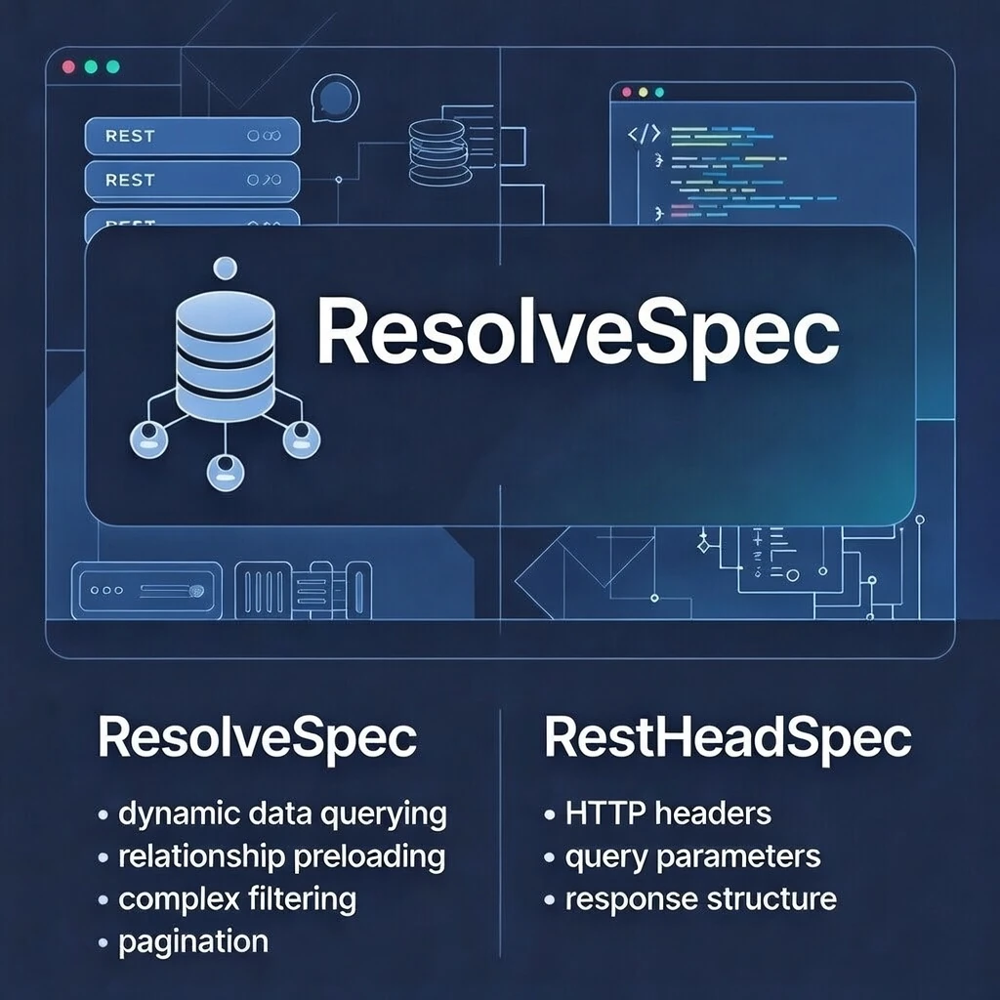

# 📜 ResolveSpec 📜


ResolveSpec is a flexible and powerful REST API specification and implementation that provides GraphQL-like capabilities while maintaining REST simplicity. It offers **multiple complementary approaches**:

1. **ResolveSpec** - Body-based API with JSON request options
2. **RestHeadSpec** - Header-based API where query options are passed via HTTP headers
3. **FuncSpec** - Header-based API to map and call API's to sql functions
4. **WebSocketSpec** - Real-time bidirectional communication with full CRUD operations
5. **MQTTSpec** - MQTT-based API ideal for IoT and mobile applications
6. **ResolveMCP** - Model Context Protocol (MCP) server that exposes models as AI-consumable tools and resources over HTTP/SSE

All share the same core architecture and provide dynamic data querying, relationship preloading, and complex filtering.



## Table of Contents

* [Features](#features)
* [Installation](#installation)
* [Quick Start](#quick-start)
  * [ResolveSpec (Body-Based API)](#resolvespec---body-based-api)
  * [RestHeadSpec (Header-Based API)](#restheadspec---header-based-api)
  * [ResolveMCP (MCP Server)](#resolvemcp---mcp-server)
* [Architecture](#architecture)
* [API Structure](#api-structure)
* [RestHeadSpec Overview](#restheadspec-header-based-api)
* [Example Usage](#example-usage)
* [Testing](#testing)
* [Additional Packages](#additional-packages)
* [Security Considerations](#security-considerations)
* [What's New](#whats-new)

## Features

### Core Features

* **Dynamic Data Querying**: Select specific columns and relationships to return
* **Relationship Preloading**: Load related entities with custom column selection and filters
* **Complex Filtering**: Apply multiple filters with various operators
* **Sorting**: Multi-column sort support
* **Pagination**: Built-in limit/offset and cursor-based pagination (both ResolveSpec and RestHeadSpec)
* **Computed Columns**: Define virtual columns for complex calculations
* **Custom Operators**: Add custom SQL conditions when needed
* **🆕 Recursive CRUD Handler**: Automatically handle nested object graphs with foreign key resolution and per-record operation control via `_request` field

### Architecture (v2.0+)

* **🆕 Database Agnostic**: Works with GORM, Bun, or any database layer through adapters
* **🆕 Router Flexible**: Integrates with Gorilla Mux, Gin, Echo, or custom routers
* **🆕 Backward Compatible**: Existing code works without changes
* **🆕 Better Testing**: Mockable interfaces for easy unit testing

### ResolveMCP (v3.2+)

* **🆕 MCP Server**: Expose any registered database model as Model Context Protocol tools and resources
* **🆕 AI-Ready Descriptions**: Tool descriptions include the full column schema, primary key, nullable flags, and relations — giving AI models everything they need to query correctly without guessing
* **🆕 Four Tools Per Model**: `read_`, `create_`, `update_`, `delete_` tools auto-registered per model
* **🆕 Full Query Support**: Filters, sort, limit/offset, cursor pagination, column selection, and relation preloading all available as tool parameters
* **🆕 HTTP/SSE Transport**: Standards-compliant SSE transport for use with Claude Desktop, Cursor, and any MCP-compatible client
* **🆕 Lifecycle Hooks**: Same Before/After hook system as ResolveSpec for auth and side-effects

### RestHeadSpec (v2.1+)

* **🆕 Header-Based API**: All query options passed via HTTP headers instead of request body
* **🆕 Lifecycle Hooks**: Before/after hooks for create, read, update, and delete operations
* **🆕 Cursor Pagination**: Efficient cursor-based pagination with complex sort support
* **🆕 Multiple Response Formats**: Simple, detailed, and Syncfusion-compatible formats
* **🆕 Single Record as Object**: Automatically normalize single-element arrays to objects (enabled by default)
* **🆕 Advanced Filtering**: Field filters, search operators, AND/OR logic, and custom SQL
* **🆕 Base64 Encoding**: Support for base64-encoded header values

### Routing & CORS (v3.0+)

* **🆕 Explicit Route Registration**: Routes created per registered model instead of dynamic lookups
* **🆕 OPTIONS Method Support**: Full OPTIONS method support returning model metadata
* **🆕 CORS Headers**: Comprehensive CORS support with all HeadSpec headers allowed
* **🆕 Better Route Control**: Customize routes per model with more flexibility

## API Structure

### URL Patterns

```text
/[schema]/[table_or_entity]/[id]
/[schema]/[table_or_entity]
/[schema]/[function]
/[schema]/[virtual]
```

### Request Format

```JSON
{
  "operation": "read|create|update|delete",
  "data": {
    // For create/update operations
  },
  "options": {
    "preload": [...],
    "columns": [...],
    "filters": [...],
    "sort": [...],
    "limit": number,
    "offset": number,
    "customOperators": [...],
    "computedColumns": [...]
  }
}
```

## RestHeadSpec: Header-Based API

RestHeadSpec provides an alternative REST API approach where all query options are passed via HTTP headers instead of the request body. This provides cleaner separation between data and metadata.

### Quick Example

```HTTP
GET /public/users HTTP/1.1
Host: api.example.com
X-Select-Fields: id,name,email,department_id
X-Preload: department:id,name
X-FieldFilter-Status: active
X-SearchOp-Gte-Age: 18
X-Sort: -created_at,+name
X-Limit: 50
X-DetailApi: true
```

For complete documentation including setup, headers, lifecycle hooks, cursor pagination, and more, see [pkg/restheadspec/README.md](pkg/restheadspec/README.md).


## Example Usage

For detailed examples of reading data, cursor pagination, recursive CRUD operations, filtering, sorting, and more, see [pkg/resolvespec/README.md](pkg/resolvespec/README.md).

## Installation

```Shell
go get github.com/bitechdev/ResolveSpec
```

## Quick Start

### ResolveSpec (Body-Based API)

ResolveSpec uses JSON request bodies to specify query options:

```Go
import "github.com/bitechdev/ResolveSpec/pkg/resolvespec"

// Create handler
handler := resolvespec.NewHandlerWithGORM(db)
handler.registry.RegisterModel("core.users", &User{})

// Setup routes
router := mux.NewRouter()
resolvespec.SetupMuxRoutes(router, handler, nil)

// Client makes POST request with body:
// POST /core/users
// {
//   "operation": "read",
//   "options": {
//     "columns": ["id", "name", "email"],
//     "filters": [{"column": "status", "operator": "eq", "value": "active"}],
//     "limit": 10
//   }
// }
```

For complete documentation, see [pkg/resolvespec/README.md](pkg/resolvespec/README.md).

### RestHeadSpec (Header-Based API)

RestHeadSpec uses HTTP headers for query options instead of request body:

```Go
import "github.com/bitechdev/ResolveSpec/pkg/restheadspec"

// Create handler with GORM
handler := restheadspec.NewHandlerWithGORM(db)

// Register models (schema.table format)
handler.Registry.RegisterModel("public.users", &User{})
handler.Registry.RegisterModel("public.posts", &Post{})

// Setup routes with Mux
router := mux.NewRouter()
restheadspec.SetupMuxRoutes(router, handler, nil)

// Client makes GET request with headers:
// GET /public/users
// X-Select-Fields: id,name,email
// X-FieldFilter-Status: active
// X-Limit: 10
// X-Sort: -created_at
// X-Preload: posts:id,title
```

For complete documentation, see [pkg/restheadspec/README.md](pkg/restheadspec/README.md).

### ResolveMCP (MCP Server)

ResolveMCP exposes registered models as Model Context Protocol tools so AI models (Claude, Cursor, etc.) can query and mutate your database directly:

```go
import "github.com/bitechdev/ResolveSpec/pkg/resolvemcp"

// Create handler
handler := resolvemcp.NewHandlerWithGORM(db)

// Register models — must be done BEFORE Build()
handler.RegisterModel("public", "users", &User{})
handler.RegisterModel("public", "posts", &Post{})

// Finalize: registers MCP tools and resources
handler.Build()

// Mount SSE transport on your existing router
router := mux.NewRouter()
resolvemcp.SetupMuxRoutes(router, handler, "http://localhost:8080")

// MCP clients connect to:
//   SSE stream:  GET  http://localhost:8080/mcp/sse
//   Messages:    POST http://localhost:8080/mcp/message
//
// Auto-registered tools per model:
//   read_public_users   — filter, sort, paginate, preload
//   create_public_users — insert a new record
//   update_public_users — update a record by ID
//   delete_public_users — delete a record by ID
```

For complete documentation, see [pkg/resolvemcp/README.md](pkg/resolvemcp/README.md) (if present) or the package source.

## Architecture

### Two Complementary APIs

```text
┌─────────────────────────────────────────────────────┐
│           ResolveSpec Framework                      │
├─────────────────────┬───────────────────────────────┤
│   ResolveSpec       │      RestHeadSpec             │
│   (Body-based)      │      (Header-based)           │
├─────────────────────┴───────────────────────────────┤
│         Common Core Components                       │
│  • Model Registry  • Filters  • Preloading          │
│  • Sorting  • Pagination  • Type System             │
└──────────────────────┬──────────────────────────────┘
                       ↓
        ┌──────────────────────────────┐
        │   Database Abstraction       │
        │   [GORM] [Bun] [Custom]      │
        └──────────────────────────────┘
```

### Database Abstraction Layer

```text
Your Application Code
        ↓
   Handler (Business Logic)
        ↓
   [Hooks & Middleware] (RestHeadSpec only)
        ↓
   Database Interface
        ↓
   [GormAdapter] [BunAdapter] [CustomAdapter]
        ↓              ↓           ↓
    [GORM]         [Bun]    [Your ORM]
```

### Supported Database Layers

* **GORM** - Full support for PostgreSQL, SQLite, MSSQL
* **Bun** - Full support for PostgreSQL, SQLite, MSSQL
* **Native SQL** - Standard library `*sql.DB` with all supported databases
* **Custom ORMs** - Implement the `Database` interface

### Supported Databases

* **PostgreSQL** - Full schema support
* **SQLite** - Automatic schema.table to schema_table translation
* **Microsoft SQL Server** - Full schema support
* **MongoDB** - NoSQL document database (via MQTTSpec and custom handlers)

### Supported Routers

* **Gorilla Mux** (built-in support with `SetupRoutes()`)
* **BunRouter** (built-in support with `SetupBunRouterWithResolveSpec()`)
* **Gin** (manual integration, see examples above)
* **Echo** (manual integration, see examples above)
* **Custom Routers** (implement request/response adapters)

## Testing

ResolveSpec is designed for testability with mockable interfaces. For testing examples and best practices, see the individual package documentation:

- [ResolveSpec Testing](pkg/resolvespec/README.md#testing)
- [RestHeadSpec Testing](pkg/restheadspec/README.md#testing)
- [WebSocketSpec Testing](pkg/websocketspec/README.md)

## Continuous Integration

ResolveSpec uses GitHub Actions for automated testing and quality checks. The CI pipeline runs on every push and pull request.

### CI/CD Workflow

The project includes automated workflows that:

* **Test**: Run all tests with race detection and code coverage
* **Lint**: Check code quality with golangci-lint
* **Build**: Verify the project builds successfully
* **Multi-version**: Test against multiple Go versions (1.23.x, 1.24.x)

### Running Tests Locally

```Shell
# Run all tests
go test -v ./...

# Run tests with coverage
go test -v -race -coverprofile=coverage.out ./...

# View coverage report
go tool cover -html=coverage.out

# Run linting
golangci-lint run
```

### Test Files

The project includes comprehensive test coverage:

* **Unit Tests**: Individual component testing
* **Integration Tests**: End-to-end API testing
* **CRUD Tests**: Standalone tests for both ResolveSpec and RestHeadSpec APIs

To run only the CRUD standalone tests:

```Shell
go test -v ./tests -run TestCRUDStandalone
```

### CI Status

Check the [Actions tab](../../actions) on GitHub to see the status of recent CI runs. All tests must pass before merging pull requests.

### Badge

Add this badge to display CI status in your fork:

```Markdown

```

## Additional Packages

ResolveSpec includes several complementary packages that work together to provide a complete web application framework:

### Core API Packages

#### ResolveSpec - Body-Based API

The core body-based REST API with GraphQL-like capabilities.

**Key Features**:
- JSON request body with operation and options
- Recursive CRUD with nested object support
- Cursor and offset pagination
- Advanced filtering and preloading
- Lifecycle hooks

For complete documentation, see [pkg/resolvespec/README.md](pkg/resolvespec/README.md).

#### RestHeadSpec - Header-Based API

Alternative REST API where query options are passed via HTTP headers.

**Key Features**:
- All query options via HTTP headers
- Same capabilities as ResolveSpec
- Cleaner separation of data and metadata
- Ideal for GET requests and caching

For complete documentation, see [pkg/restheadspec/README.md](pkg/restheadspec/README.md).

#### ResolveMCP - MCP Server

Expose any registered model as Model Context Protocol tools and resources consumable by AI models over HTTP/SSE.

**Key Features**:
- Four tools per model: `read_`, `create_`, `update_`, `delete_`
- Rich AI-readable descriptions: column names, types, primary key, nullable flags, and preloadable relations
- Full query support: filters, sort, limit/offset, cursor pagination, column selection, preloads
- HTTP/SSE transport compatible with Claude Desktop, Cursor, and any MCP client
- Same Before/After lifecycle hooks as ResolveSpec

For complete documentation, see [pkg/resolvemcp/](pkg/resolvemcp/).

#### FuncSpec - Function-Based SQL API

Execute SQL functions and queries through a simple HTTP API with header-based parameters.

**Key Features**:
- Direct SQL function invocation
- Header-based parameter passing
- Automatic pagination and counting
- Request/response hooks
- Variable substitution support

For complete documentation, see [pkg/funcspec/](pkg/funcspec/).

#### ResolveSpec JS - TypeScript Client Library

TypeScript/JavaScript client library supporting all three REST and WebSocket protocols.

**Clients**:
- Body-based REST client (`read`, `create`, `update`, `deleteEntity`)
- Header-based REST client (`HeaderSpecClient`)
- WebSocket client (`WebSocketClient`) with CRUD, subscriptions, heartbeat, reconnect

For complete documentation, see [resolvespec-js/README.md](resolvespec-js/README.md).

### Real-Time Communication

#### WebSocketSpec - WebSocket API

Real-time bidirectional communication with full CRUD operations and subscriptions.

**Key Features**:
- Persistent WebSocket connections
- Real-time subscriptions to entity changes
- Automatic push notifications
- Full CRUD with filtering and sorting
- Connection lifecycle management

For complete documentation, see [pkg/websocketspec/README.md](pkg/websocketspec/README.md).

#### MQTTSpec - MQTT-Based API

MQTT-based database operations ideal for IoT and mobile applications.

**Key Features**:
- Embedded or external MQTT broker support
- QoS 1 (at-least-once delivery)
- Real-time subscriptions
- Multi-tenancy support
- Optimized for unreliable networks

For complete documentation, see [pkg/mqttspec/README.md](pkg/mqttspec/README.md).

### Server Components

#### StaticWeb - Static File Server

Flexible, interface-driven static file server.

**Key Features**:
- Router-agnostic with standard `http.Handler`
- Multiple filesystem backends (local, zip, embedded)
- Pluggable cache, MIME, and fallback policies
- Hot-reload support
- 140+ MIME types including modern formats

**Quick Example**:
```go
import "github.com/bitechdev/ResolveSpec/pkg/server/staticweb"

service := staticweb.NewService(nil)
provider, _ := staticweb.LocalProvider("./public")

service.Mount(staticweb.MountConfig{
    URLPrefix:        "/",
    Provider:         provider,
    FallbackStrategy: staticweb.HTMLFallback("index.html"),
})

router.PathPrefix("/").Handler(service.Handler())
```

For complete documentation, see [pkg/server/staticweb/README.md](pkg/server/staticweb/README.md).

### Infrastructure & Utilities

#### Event Broker

Comprehensive event handling system for real-time event publishing and cross-instance communication.

**Key Features**:
- Multiple event sources (database, websockets, frontend, system)
- Multiple providers (in-memory, Redis Streams, NATS, PostgreSQL)
- Pattern-based subscriptions
- Automatic CRUD event capture
- Retry logic with exponential backoff
- Prometheus metrics

For complete documentation, see [pkg/eventbroker/README.md](pkg/eventbroker/README.md).

#### Database Connection Manager

Centralized management of multiple database connections with support for PostgreSQL, SQLite, MSSQL, and MongoDB.

**Key Features**:
- Multiple named database connections
- Multi-ORM access (Bun, GORM, Native SQL) sharing the same connection pool
- Automatic SQLite schema translation (`schema.table` → `schema_table`)
- Health checks with auto-reconnect
- Prometheus metrics for monitoring
- Configuration-driven via YAML
- Per-connection statistics and management

For documentation, see [pkg/dbmanager/README.md](pkg/dbmanager/README.md).

#### Cache

Caching system with support for in-memory and Redis backends.

For documentation, see [pkg/cache/README.md](pkg/cache/README.md).

#### Security

Authentication and authorization framework with hooks integration.

For documentation, see [pkg/security/README.md](pkg/security/README.md).

#### Middleware

HTTP middleware collection for common tasks (CORS, logging, metrics, etc.).

For documentation, see [pkg/middleware/README.md](pkg/middleware/README.md).

#### OpenAPI

OpenAPI/Swagger documentation generation for ResolveSpec APIs.

For documentation, see [pkg/openapi/README.md](pkg/openapi/README.md).

#### Metrics

Prometheus-compatible metrics collection and exposition.

For documentation, see [pkg/metrics/README.md](pkg/metrics/README.md).

#### Tracing

Distributed tracing with OpenTelemetry support.

For documentation, see [pkg/tracing/README.md](pkg/tracing/README.md).

#### Error Tracking

Error tracking and reporting integration.

For documentation, see [pkg/errortracking/README.md](pkg/errortracking/README.md).

#### Configuration

Configuration management with support for multiple formats and environments.

For documentation, see [pkg/config/README.md](pkg/config/README.md).

## Security Considerations

* Implement proper authentication and authorization
* Validate all input parameters
* Use prepared statements (handled by GORM/Bun/your ORM)
* Implement rate limiting
* Control access at schema/entity level
* **New**: Database abstraction layer provides additional security through interface boundaries

## Contributing

1. Fork the repository
2. Create your feature branch (`git checkout -b feature/amazing-feature`)
3. Commit your changes (`git commit -m 'Add some amazing feature'`)
4. Push to the branch (`git push origin feature/amazing-feature`)
5. Open a Pull Request

## License

This project is licensed under the MIT License - see the [LICENSE](LICENSE) file for details.

## What's New

### v3.2 (Latest - March 2026)

**ResolveMCP - Model Context Protocol Server (🆕)**:

* **MCP Tools**: Four tools auto-registered per model (`read_`, `create_`, `update_`, `delete_`) over HTTP/SSE transport
* **AI-Ready Descriptions**: Full column schema, primary key, nullable flags, and relation names surfaced in tool descriptions so AI models can query without guessing
* **Full Query Support**: Filters, sort, limit/offset, cursor pagination, column selection, and relation preloading all available as tool parameters
* **HTTP/SSE Transport**: Standards-compliant transport compatible with Claude Desktop, Cursor, and any MCP 2024-11-05 client
* **Lifecycle Hooks**: Same Before/After hook system as ResolveSpec for auth, auditing, and side-effects
* **MCP Resources**: Each model also exposed as a named resource for direct data access by AI clients

### v3.1 (February 2026)

**SQLite Schema Translation (🆕)**:

* **Automatic Schema Translation**: SQLite support with automatic `schema.table` to `schema_table` conversion
* **Database Agnostic Models**: Write models once, use across PostgreSQL, SQLite, and MSSQL
* **Transparent Handling**: Translation occurs automatically in all operations (SELECT, INSERT, UPDATE, DELETE, preloads)
* **All ORMs Supported**: Works with Bun, GORM, and Native SQL adapters

### v3.0 (December 2025)

**Explicit Route Registration (🆕)**:

* **Breaking Change**: Routes are now created explicitly for each registered model
* **Better Control**: Customize routes per model with more flexibility
* **Registration Order**: Models must be registered BEFORE calling SetupMuxRoutes/SetupBunRouterRoutes
* **Benefits**: More flexible routing, easier to add custom routes per model, better performance

**OPTIONS Method & CORS Support (🆕)**:

* **OPTIONS Endpoint**: Full OPTIONS method support for CORS preflight requests
* **Metadata Response**: OPTIONS returns model metadata (same as GET /metadata)
* **CORS Headers**: Comprehensive CORS headers on all responses
* **Header Support**: All HeadSpec custom headers (`X-Select-Fields`, `X-FieldFilter-*`, etc.) allowed
* **No Auth on OPTIONS**: CORS preflight requests don't require authentication
* **Configurable**: Customize CORS settings via `common.CORSConfig`

### v2.1

**Cursor Pagination for ResolveSpec (🆕 Dec 9, 2025)**:

* **Cursor-Based Pagination**: Efficient cursor pagination now available in ResolveSpec (body-based API)
* **Consistent with RestHeadSpec**: Both APIs now support cursor pagination for feature parity
* **Multi-Column Sort Support**: Works seamlessly with complex sorting requirements
* **Better Performance**: Improved performance for large datasets compared to offset pagination
* **SQL Safety**: Proper SQL sanitization for cursor values

**Recursive CRUD Handler (🆕 Nov 11, 2025)**:

* **Nested Object Graphs**: Automatically handle complex object hierarchies with parent-child relationships
* **Foreign Key Resolution**: Automatic propagation of parent IDs to child records
* **Per-Record Operations**: Control create/update/delete operations per record via `_request` field
* **Transaction Safety**: All nested operations execute atomically within database transactions
* **Relationship Detection**: Automatic detection of belongsTo, hasMany, hasOne, and many2many relationships
* **Deep Nesting Support**: Handle relationships at any depth level
* **Mixed Operations**: Combine insert, update, and delete operations in a single request

**Primary Key Improvements (Nov 11, 2025)**:

* **GetPrimaryKeyName**: Enhanced primary key detection for better preload and ID field handling
* **Better GORM/Bun Support**: Improved compatibility with both ORMs for primary key operations
* **Computed Column Support**: Fixed computed columns functionality across handlers

**Database Adapter Enhancements (Nov 11, 2025)**:

* **Bun ORM Relations**: Using Scan model method for better has-many and many-to-many relationship handling
* **Model Method Support**: Enhanced query building with proper model registration
* **Improved Type Safety**: Better handling of relationship queries with type-aware scanning

**RestHeadSpec - Header-Based REST API**:

* **Header-Based Querying**: All query options via HTTP headers instead of request body
* **Lifecycle Hooks**: Before/after hooks for create, read, update, delete operations
* **Cursor Pagination**: Efficient cursor-based pagination with complex sorting
* **Advanced Filtering**: Field filters, search operators, AND/OR logic
* **Multiple Response Formats**: Simple, detailed, and Syncfusion-compatible responses
* **Single Record as Object**: Automatically return single-element arrays as objects (default, toggleable via header)
* **Base64 Support**: Base64-encoded header values for complex queries
* **Type-Aware Filtering**: Automatic type detection and conversion for filters

**Core Improvements**:

* Better model registry with schema.table format support
* Enhanced validation and error handling
* Improved reflection safety
* Fixed COUNT query issues with table aliasing
* Better pointer handling throughout the codebase
* **Comprehensive Test Coverage**: Added standalone CRUD tests for both ResolveSpec and RestHeadSpec

### v2.0

**Breaking Changes**:

* **None!** Full backward compatibility maintained

**New Features**:

* **Database Abstraction**: Support for GORM, Bun, and custom ORMs
* **Router Flexibility**: Works with any HTTP router through adapters
* **BunRouter Integration**: Built-in support for uptrace/bunrouter
* **Better Architecture**: Clean separation of concerns with interfaces
* **Enhanced Testing**: Mockable interfaces for comprehensive testing

**Performance Improvements**:

* More efficient query building through interface design
* Reduced coupling between components
* Better memory management with interface boundaries

## Acknowledgments

* Inspired by REST, OData, and GraphQL's flexibility
* **Header-based approach**: Inspired by REST best practices and clean API design
* **Database Support**: [GORM](https://gorm.io) and [Bun](https://bun.uptrace.dev/)
* **Router Support**: Gorilla Mux (built-in), BunRouter, Gin, Echo, and others through adapters
* Slogan generated using DALL-E
* AI used for documentation checking and correction
* Community feedback and contributions that made v2.0 and v2.1 possible
